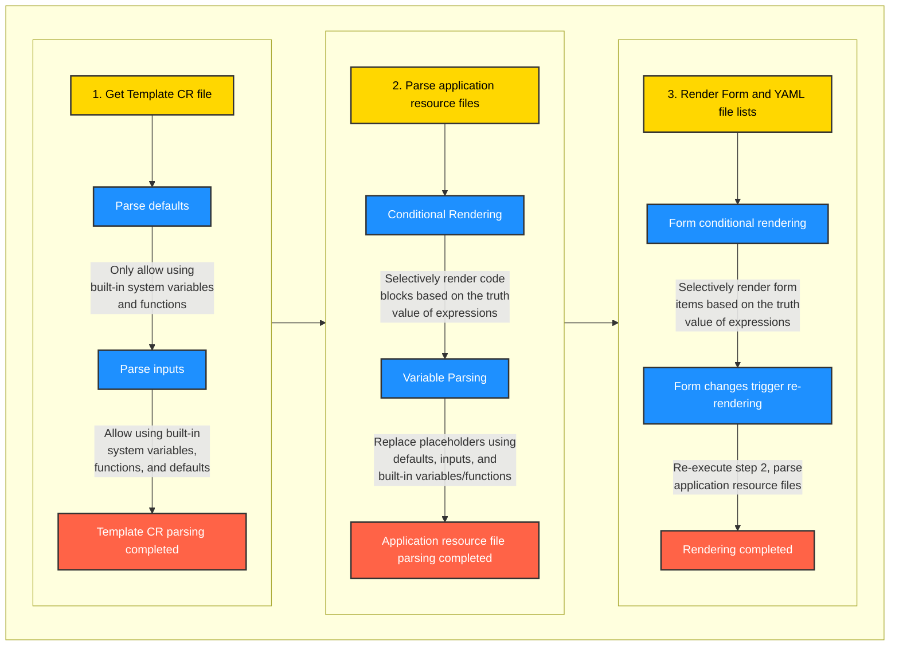

# Guidance For Template
This guidance is aiming to clarify how to create and upload a self-defined template for any application you want.
Taking WordPress as an example here to demonstrate the full process. 
This example assumes that you already have a certain understanding of Kubernetes resource files, and will only explains some parameters unique to the template. 
# Template file
Here is an example of Wordpress:
```yaml
apiVersion: app.claw.cloud/v1
kind: Template
metadata:
  name: wordpress
spec:
  title: 'WordPress'
  type: official
  author: ClawCloud Run
  author_id: 180503656
  date: 2025-04-17
  url: 'https://wordpress.org'
  gitRepo: 'https://github.com/WordPress/WordPress'
  description: 'WordPress is a powerful, user-friendly and open source content management system (CMS) that can be used to publish websites, news, blogs and other content on the Internet.'
  readme: 'https://raw.githubusercontent.com/ClawCloud/Run-Template/refs/heads/main/template/wordpress/README.md'
  images:
    - 'https://raw.githubusercontent.com/ClawCloud/Run-Template/refs/heads/main/template/wordpress/Picture1.png'
    - 'https://raw.githubusercontent.com/ClawCloud/Run-Template/refs/heads/main/template/wordpress/Picture2.png'
    - 'https://raw.githubusercontent.com/ClawCloud/Run-Template/refs/heads/main/template/wordpress/Picture3.png'
  icon: 'https://raw.githubusercontent.com/WordPress/WordPress/master/wp-admin/images/wordpress-logo.svg'
  templateType: inline
  categories:
    - blog
  defaults:
    app_host:
      # number or string.
      type: string
      value: ${{ random(8) }}
    app_name:
      type: string
      value: wordpress-${{ random(8) }}
  inputs:

---

apiVersion: v1
kind: ServiceAccount
metadata:
  labels:
    clawcloud-db-provider-cr: ${{ defaults.app_name }}-mysql
    app.kubernetes.io/instance: ${{ defaults.app_name }}-mysql
    app.kubernetes.io/managed-by: kbcli
  name: ${{ defaults.app_name }}-mysql

---

apiVersion: apps/v1
kind: StatefulSet
metadata:
  name: ${{ defaults.app_name }}
  annotations:
    originImageName: wordpress:6.5.4
    deploy.run.claw.cloud/minReplicas: '1'
    deploy.run.claw.cloud/maxReplicas: '1'
  labels:
    run.claw.cloud/app-deploy-manager: ${{ defaults.app_name }}
    app: ${{ defaults.app_name }}
spec:
  replicas: 1
  revisionHistoryLimit: 1
  minReadySeconds: 10
  serviceName: ${{ defaults.app_name }}
  selector:
    matchLabels:
      app: ${{ defaults.app_name }}
  template:
    metadata:
      labels:
        app: ${{ defaults.app_name }}
    spec:
      terminationGracePeriodSeconds: 10
      automountServiceAccountToken: false
      containers:
        - name: ${{ defaults.app_name }}
          image: wordpress:6.5.4
          env:
            - name: WORDPRESS_DB_HOST
              value: ${{ defaults.app_name }}-mysql-mysql.${{ CLAWCLOUD_NAMESPACE }}.svc
            - name: WORDPRESS_DB_USER
              value: root
            - name: WORDPRESS_DB_PASSWORD
              valueFrom:
                secretKeyRef:
                  name: ${{ defaults.app_name }}-mysql-conn-credential
                  key: password
            - name: WORDPRESS_DB_NAME
              value: mydb
          resources:
            requests:
              cpu: 50m
              memory: 102Mi
            limits:
              cpu: 200m
              memory: 512Mi
          command: []
          args: []
          ports:
            - containerPort: 80
          imagePullPolicy: IfNotPresent
          volumeMounts:
            - name: var-www-html
              mountPath: /var/www/html
      volumes: []
  volumeClaimTemplates:
    - metadata:
        annotations:
          path: /var/www/html
          value: '1'
        name: var-www-html
      spec:
        accessModes:
          - ReadWriteOnce
        resources:
          requests:
            storage: 1Gi

---
apiVersion: v1
kind: Service
metadata:
  name: ${{ defaults.app_name }}
  labels:
    run.claw.cloud/app-deploy-manager: ${{ defaults.app_name }}
spec:
  ports:
    - port: 80
  selector:
    app: ${{ defaults.app_name }}

---
apiVersion: networking.k8s.io/v1
kind: Ingress
metadata:
  name: ${{ defaults.app_name }}
  labels:
    run.claw.cloud/app-deploy-manager: ${{ defaults.app_name }}
    run.claw.cloud/app-deploy-manager-domain: ${{ defaults.app_host }}
  annotations:
    kubernetes.io/ingress.class: nginx
    nginx.ingress.kubernetes.io/proxy-body-size: 32m
    nginx.ingress.kubernetes.io/server-snippet: |
      client_header_buffer_size 64k;
      large_client_header_buffers 4 128k;
    nginx.ingress.kubernetes.io/ssl-redirect: 'false'
    nginx.ingress.kubernetes.io/backend-protocol: HTTP
    nginx.ingress.kubernetes.io/rewrite-target: /$2
    nginx.ingress.kubernetes.io/client-body-buffer-size: 64k
    nginx.ingress.kubernetes.io/proxy-buffer-size: 64k
    nginx.ingress.kubernetes.io/configuration-snippet: |
      if ($request_uri ~* \.(js|css|gif|jpe?g|png)) {
        expires 30d;
        add_header Cache-Control "public";
      }
spec:
  rules:
    - host: ${{ defaults.app_host }}.${{ CLAWCLOUD_CLOUD_DOMAIN }}
      http:
        paths:
          - pathType: Prefix
            path: /()(.*)
            backend:
              service:
                name: ${{ defaults.app_name }}
                port:
                  number: 80
  tls:
    - hosts:
        - ${{ defaults.app_host }}.${{ CLAWCLOUD_CLOUD_DOMAIN }}
      secretName: ${{ CLAWCLOUD_CERT_SECRET_NAME }}

---
apiVersion: apps.kubeblocks.io/v1alpha1
kind: Cluster
metadata:
  finalizers:
    - cluster.kubeblocks.io/finalizer
  labels:
    clusterdefinition.kubeblocks.io/name: apecloud-mysql
    clusterversion.kubeblocks.io/name: ac-mysql-8.0.30
  name: ${{ defaults.app_name }}-mysql
spec:
  affinity:
    nodeLabels: {}
    podAntiAffinity: Preferred
    tenancy: SharedNode
    topologyKeys: []
  clusterDefinitionRef: apecloud-mysql
  clusterVersionRef: ac-mysql-8.0.30
  componentSpecs:
    - componentDefRef: mysql
      monitor: true
      name: mysql
      replicas: 1
      resources:
        limits:
          cpu: 500m
          memory: 512Mi
        requests:
          cpu: 25m
          memory: 51Mi
      serviceAccountName: ${{ defaults.app_name }}-mysql
      volumeClaimTemplates:
        - name: data
          spec:
            accessModes:
              - ReadWriteOnce
            resources:
              requests:
                storage: 3Gi

  terminationPolicy: Delete
  tolerations: []

---

apiVersion: rbac.authorization.k8s.io/v1
kind: Role
metadata:
  labels:
    clawcloud-db-provider-cr: ${{ defaults.app_name }}-mysql
    app.kubernetes.io/instance: ${{ defaults.app_name }}-mysql
    app.kubernetes.io/managed-by: kbcli
  name: ${{ defaults.app_name }}-mysql
rules:
  - apiGroups:
      - '*'
    resources:
      - '*'
    verbs:
      - '*'

---
apiVersion: rbac.authorization.k8s.io/v1
kind: RoleBinding
metadata:
  labels:
    clawcloud-db-provider-cr: ${{ defaults.app_name }}-mysql
    app.kubernetes.io/instance: ${{ defaults.app_name }}-mysql
    app.kubernetes.io/managed-by: kbcli
  name: ${{ defaults.app_name }}-mysql
roleRef:
  apiGroup: rbac.authorization.k8s.io
  kind: Role
  name: ${{ defaults.app_name }}-mysql
subjects:
  - kind: ServiceAccount
    name: ${{ defaults.app_name }}-mysql

---

apiVersion: app.claw.cloud/v1
kind: App
metadata:
  name: ${{ defaults.app_name }}
  labels:
    run.claw.cloud/app-deploy-manager: ${{ defaults.app_name }}
spec:
  data:
    url: https://${{ defaults.app_host }}.${{ CLAWCLOUD_CLOUD_DOMAIN }}
  displayType: normal
  icon: "https://raw.githubusercontent.com/WordPress/WordPress/master/wp-admin/images/wordpress-logo.svg"
  name: ${{ defaults.app_name }}
  type: link
```

Let's go through the template step by step:

# Part 1 - Template CR

CR short for Custom Resource, it is a Kubernetes object that allows you to extend the Kubernetes API with your own resources. 
Let's first go with the global part:
| name | description |
| ---      | ---     | 
| apiVersion | Currently, we may follow 'app.claw.cloud/v1'. |
| kind | Since this is a template, it is set to 'Template'. | 
| metadata | Just include the name of your template. |
| spec | Specify the spec of your template. |

Then, let's move to the spec part:
| name | description |
| ---      | ---     | 
| basic information | things like title/type/author will affect how this template is displayed in the UI. |
| templateType | 'inline' indicates this is an inline mode, all yaml files are integrated in single file. |
| categories | Define how your template will be categorized.|
| defaults | Define default values, such as application name (app_name), domain name (app_host), etc. |
| inputs | Define parameters needed during deployment, such as Email, API-KEY, etc. It can be omitted by setting none.|

## Explanation 1: Variables

Any characters enclosed in ${{ }} are variables, there are 3 types of variables:

### built-in system variables

- `${{ ClAWCLOUD_NAMESPACE }}`
- `${{ CLAWCLOUD_CLOUD_DOMAIN }}`
- `${{ CLAWCLOUD_CERT_SECRET_NAME }}`
- `${{ CLAWCLOUD_SERVICE_ACCOUNT }}`

### functions
- `${{ random(length) }}`: It will generate a random string of length.
- `${{ base64(expression) }}`: It will encode the expression into base64 format.
    eg: ${{ base64('hello world') }} refers to aGVsbG8gd29ybGQ=.
    You can also specify variables, like ${{ base64(inputs.secret) }}

### defaults
variables like `${{defualts.x}}` are defualt values  

### inputs
variables like `${{inputs.x}}` are input values by users

## Explanation 2: spec.defaults
spec.defaults is a map of names, types and values that are filled by default.

| name | description |
| ---      | ---     | 
| type | type of the variable, string type will be quoted when rendered. |
| value | value of the variable, function will be rendered. |

Notice: Currently, there must be app_name for default, and it must contain a random string generated by `${{ random(8) }}` as the unique name of the application, otherwise an error will occur.

## Explanation 3: inputs
spec.inputs is a map of defined objects that are parsed and shown as form inputs for users.

| name | description |
| ---      | ---     | 
| description | It will be rendered as input placeholder.. |
| default | Default value of the input. |
| required | Whether the input is required. |
| type | Must be one of string / number / choice / boolean |
| options? | Only for choice type. |
| if? | JavaScript expression, defines whether this option is enabled.|

### Example:

```yaml
inputs:
  root_passowrd:
    description: 'Set root password. login: username: root, password: root_passowrd'
    type: string
    default: ''
    required: true
  openai_key:
    description: 'openai api key'
    type: string
    default: ''
    required: true
```

# Part 2 - Resources

It usually consists of a group of types of resources:
    Applications **Deployment**, **StatefulSet**, **Service**
    External **Access**, **Ingress**
    Persistence **Requirements**, **Database**, **Object Storage**
Each one can repeat any times.

## Explanation 1: conditional renderring

The template engine supports conditional rendering by using `${{ if(expression) }}`, `${{ elif(expression) }}`, `${{ else() }}`, and `${{ endif() }}`.

### Rules:
1. Conditional statements must be on a separate line and cannot be on the same line as other content.
2. Conditional expressions must return a boolean value (true or false), otherwise they will be coerced into a boolean value.
3. It is allowed for rendering across yaml lists.
4. It is not allowed in Template CR.
### Example:
```
${{ if(inputs.enableIngress === 'true') }}
apiVersion: networking.k8s.io/v1
kind: Ingress
...
${{ endif() }}
```

## Explanation 2: Applications

Including as many as Deployment, StatefulSet, Service Or/And Job, Secret, ConfigMap, Custom Resource as you want.

Frequently used:
| name | description |
| ---      | ---     | 
| metadata.annotations / metadata.labels| Matching launchpad's requirements, like originImageName, minReplicas, maxReplicas. |
| spec.containers[].image | Change to Docker image. |
| spec.containers[].env | Configure environment variables. |
| spec.containers[].ports.containerPort | Change to the port corresponding to your Docker image. |
| ${{ defaults.app_name }} | You can use the ${{ defaults.xxxx }}|${{ inputs.xxxx }} variables to set parameters defined in the Template CR. |

## Explanation 3: External Accesses

It will be applied when application needs to be accessed externally.
### Example:

```yaml
apiVersion: networking.k8s.io/v1
kind: Ingress
metadata:
  name: ${{ defaults.app_name }}
  labels:
    run.claw.cloud/app-deploy-manager: ${{ defaults.app_name }}
    run.claw.cloud/app-deploy-manager-domain: ${{ defaults.app_host }}
  annotations:
    kubernetes.io/ingress.class: nginx
    nginx.ingress.kubernetes.io/proxy-body-size: 32m
    nginx.ingress.kubernetes.io/server-snippet: |
      client_header_buffer_size 64k;
      large_client_header_buffers 4 128k;
    nginx.ingress.kubernetes.io/ssl-redirect: 'false'
    nginx.ingress.kubernetes.io/backend-protocol: HTTP
    nginx.ingress.kubernetes.io/rewrite-target: /$2
    nginx.ingress.kubernetes.io/client-body-buffer-size: 64k
    nginx.ingress.kubernetes.io/proxy-buffer-size: 64k
    nginx.ingress.kubernetes.io/configuration-snippet: |
      if ($request_uri ~* \.(js|css|gif|jpe?g|png)) {
        expires 30d;
        add_header Cache-Control "public";
      }
spec:
  rules:
    - host: ${{ defaults.app_host }}.${{ CLAWCLOUD_CLOUD_DOMAIN }}
      http:
        paths:
          - pathType: Prefix
            path: /()(.*)
            backend:
              service:
                name: ${{ defaults.app_name }}
                port:
                  number: 3000
  tls:
    - hosts:
        - ${{ defaults.app_host }}.${{ CLAWCLOUD_CLOUD_DOMAIN }}
      secretName: ${{ CLAWCLOUD_CERT_SECRET_NAME }}
```

Notice: The host field needs to be randomly set for security purpose. You can use $`{{ random(8) }}` set to defaults.app_host and use `${{ defaults.app_host }}` then.

## Explanation 4: NodePort Type Services

It will be applied when the application needs to expose services through a NodePort type Service, and the service name should be suffixed with -nodeport

### Example:
```yaml
apiVersion: v1
kind: Service
metadata:
  name: ${{ defaults.app_name }}-nodeport
  labels:
    run.claw.cloud/app-deploy-manager: ${{ defaults.app_name }}
spec:
  type: NodePort
  ports:
    - protocol: UDP
      port: 21116
      targetPort: 21116
      name: "rendezvous-udp"
    - protocol: TCP
      port: 21116
      targetPort: 21116
      name: "rendezvous-tcp"
    - protocol: TCP
      port: 21117
      targetPort: 21117
      name: "relay"
    - protocol: TCP
      port: 21115
      targetPort: 21115
      name: "heartbeat"
  selector:
    app: ${{ defaults.app_name }}
```

## Explanation 5: Persistence Requirements
### Database

We using kubeblocks to provide database resources support.

<summary>MongoDB</summary>

```yaml
apiVersion: apps.kubeblocks.io/v1alpha1
kind: Cluster
metadata:
  finalizers:
    - cluster.kubeblocks.io/finalizer
  labels:
    clusterdefinition.kubeblocks.io/name: mongodb
    clusterversion.kubeblocks.io/name: mongodb-5.0
    clawcloud-db-provider-cr: ${{ defaults.app_name }}-mongo
  annotations: {}
  name: ${{ defaults.app_name }}-mongo
  generation: 1
spec:
  affinity:
    nodeLabels: {}
    podAntiAffinity: Preferred
    tenancy: SharedNode
    topologyKeys: []
  clusterDefinitionRef: mongodb
  clusterVersionRef: mongodb-5.0
  componentSpecs:
    - componentDefRef: mongodb
      monitor: true
      name: mongodb
      replicas: 1
      resources:
        limits:
          cpu: 1000m
          memory: 1024Mi
        requests:
          cpu: 100m
          memory: 102Mi
      serviceAccountName: ${{ defaults.app_name }}-mongo
      volumeClaimTemplates:
        - name: data
          spec:
            accessModes:
              - ReadWriteOnce
            resources:
              requests:
                storage: 3Gi
            storageClassName: openebs-backup  
  terminationPolicy: Delete
  tolerations: []


---
apiVersion: v1
kind: ServiceAccount
metadata:
  labels:
    clawcloud-db-provider-cr: ${{ defaults.app_name }}-mongo
    app.kubernetes.io/instance: ${{ defaults.app_name }}-mongo
    app.kubernetes.io/managed-by: kbcli
  name: ${{ defaults.app_name }}-mongo

---
apiVersion: rbac.authorization.k8s.io/v1
kind: Role
metadata:
  labels:
    clawcloud-db-provider-cr: ${{ defaults.app_name }}-mongo
    app.kubernetes.io/instance: ${{ defaults.app_name }}-mongo
    app.kubernetes.io/managed-by: kbcli
  name: ${{ defaults.app_name }}-mongo
rules:
  - apiGroups:
      - '*'
    resources:
      - '*'
    verbs:
      - '*'

---
apiVersion: rbac.authorization.k8s.io/v1
kind: RoleBinding
metadata:
  labels:
    clawcloud-db-provider-cr: ${{ defaults.app_name }}-mongo
    app.kubernetes.io/instance: ${{ defaults.app_name }}-mongo
    app.kubernetes.io/managed-by: kbcli
  name: ${{ defaults.app_name }}-mongo
roleRef:
  apiGroup: rbac.authorization.k8s.io
  kind: Role
  name: ${{ defaults.app_name }}-mongo
subjects:
  - kind: ServiceAccount
    name: ${{ defaults.app_name }}-mongo
```

</details>

<details>

<summary>PostgreSQL</summary>

```yaml
apiVersion: apps.kubeblocks.io/v1alpha1
kind: Cluster
metadata:
  finalizers:
    - cluster.kubeblocks.io/finalizer
  labels:
    clusterdefinition.kubeblocks.io/name: postgresql
    clusterversion.kubeblocks.io/name: postgresql-14.8.0
    clawcloud-db-provider-cr: ${{ defaults.app_name }}-pg
  annotations: {}
  name: ${{ defaults.app_name }}-pg
spec:
  affinity:
    nodeLabels: {}
    podAntiAffinity: Preferred
    tenancy: SharedNode
    topologyKeys: []
  clusterDefinitionRef: postgresql
  clusterVersionRef: postgresql-14.8.0
  componentSpecs:
    - componentDefRef: postgresql
      monitor: true
      name: postgresql
      replicas: 1
      resources:
        limits:
          cpu: 1000m
          memory: 1024Mi
        requests:
          cpu: 100m
          memory: 102Mi
      serviceAccountName: ${{ defaults.app_name }}-pg
      switchPolicy:
        type: Noop
      volumeClaimTemplates:
        - name: data
          spec:
            accessModes:
              - ReadWriteOnce
            resources:
              requests:
                storage: 5Gi
            storageClassName: openebs-backup
  terminationPolicy: Delete
  tolerations: []

---
apiVersion: v1
kind: ServiceAccount
metadata:
  labels:
    clawcloud-db-provider-cr: ${{ defaults.app_name }}-pg
    app.kubernetes.io/instance: ${{ defaults.app_name }}-pg
    app.kubernetes.io/managed-by: kbcli
  name: ${{ defaults.app_name }}-pg

---
apiVersion: rbac.authorization.k8s.io/v1
kind: Role
metadata:
  labels:
    clawcloud-db-provider-cr: ${{ defaults.app_name }}-pg
    app.kubernetes.io/instance: ${{ defaults.app_name }}-pg
    app.kubernetes.io/managed-by: kbcli
  name: ${{ defaults.app_name }}-pg
rules:
  - apiGroups:
      - '*'
    resources:
      - '*'
    verbs:
      - '*'
---
apiVersion: rbac.authorization.k8s.io/v1
kind: RoleBinding
metadata:
  labels:
    clawcloud-db-provider-cr: ${{ defaults.app_name }}-pg
    app.kubernetes.io/instance: ${{ defaults.app_name }}-pg
    app.kubernetes.io/managed-by: kbcli
  name: ${{ defaults.app_name }}-pg
roleRef:
  apiGroup: rbac.authorization.k8s.io
  kind: Role
  name: ${{ defaults.app_name }}-pg
subjects:
  - kind: ServiceAccount
    name: ${{ defaults.app_name }}-pg
```

</details>

<details>

<summary>MySQL</summary>

```yaml
apiVersion: apps.kubeblocks.io/v1alpha1
kind: Cluster
metadata:
  finalizers:
    - cluster.kubeblocks.io/finalizer
  labels:
    clusterdefinition.kubeblocks.io/name: apecloud-mysql
    clusterversion.kubeblocks.io/name: ac-mysql-8.0.30
    clawcloud-db-provider-cr: ${{ defaults.app_name }}-mysql
  annotations: {}
  name: ${{ defaults.app_name }}-mysql
spec:
  affinity:
    nodeLabels: {}
    podAntiAffinity: Preferred
    tenancy: SharedNode
    topologyKeys: []
  clusterDefinitionRef: apecloud-mysql
  clusterVersionRef: ac-mysql-8.0.30
  componentSpecs:
    - componentDefRef: mysql
      monitor: true
      name: mysql
      replicas: 1
      resources:
        limits:
          cpu: 1000m
          memory: 1024Mi
        requests:
          cpu: 100m
          memory: 102Mi
      serviceAccountName: ${{ defaults.app_name }}-mysql
      volumeClaimTemplates:
        - name: data
          spec:
            accessModes:
              - ReadWriteOnce
            resources:
              requests:
                storage: 3Gi
            storageClassName: openebs-backup
  terminationPolicy: Delete
  tolerations: []
---
apiVersion: v1
kind: ServiceAccount
metadata:
  labels:
    clawcloud-db-provider-cr: ${{ defaults.app_name }}-mysql
    app.kubernetes.io/instance: ${{ defaults.app_name }}-mysql
    app.kubernetes.io/managed-by: kbcli
  name: ${{ defaults.app_name }}-mysql

---
apiVersion: rbac.authorization.k8s.io/v1
kind: Role
metadata:
  labels:
    clawcloud-db-provider-cr: ${{ defaults.app_name }}-mysql
    app.kubernetes.io/instance: ${{ defaults.app_name }}-mysql
    app.kubernetes.io/managed-by: kbcli
  name: ${{ defaults.app_name }}-mysql
rules:
  - apiGroups:
      - '*'
    resources:
      - '*'
    verbs:
      - '*'

---
apiVersion: rbac.authorization.k8s.io/v1
kind: RoleBinding
metadata:
  labels:
    clawcloud-db-provider-cr: ${{ defaults.app_name }}-mysql
    app.kubernetes.io/instance: ${{ defaults.app_name }}-mysql
    app.kubernetes.io/managed-by: kbcli
  name: ${{ defaults.app_name }}-mysql
roleRef:
  apiGroup: rbac.authorization.k8s.io
  kind: Role
  name: ${{ defaults.app_name }}-mysql
subjects:
  - kind: ServiceAccount
    name: ${{ defaults.app_name }}-mysql

```

</details>

<details>

<summary>Redis</summary>

```yaml
apiVersion: apps.kubeblocks.io/v1alpha1
kind: Cluster
metadata:
  finalizers:
    - cluster.kubeblocks.io/finalizer
  labels:
    clusterdefinition.kubeblocks.io/name: redis
    clusterversion.kubeblocks.io/name: redis-7.0.6
    clawcloud-db-provider-cr: ${{ defaults.app_name }}-redis
  annotations: {}
  name: ${{ defaults.app_name }}-redis
spec:
  affinity:
    nodeLabels: {}
    podAntiAffinity: Preferred
    tenancy: SharedNode
    topologyKeys: []
  clusterDefinitionRef: redis
  clusterVersionRef: redis-7.0.6
  componentSpecs:
    - componentDefRef: redis
      monitor: true
      name: redis
      replicas: 1
      resources:
        limits:
          cpu: 1000m
          memory: 1024Mi
        requests:
          cpu: 100m
          memory: 102Mi
      serviceAccountName: ${{ defaults.app_name }}-redis
      switchPolicy:
        type: Noop
      volumeClaimTemplates:
        - name: data
          spec:
            accessModes:
              - ReadWriteOnce
            resources:
              requests:
                storage: 3Gi
            storageClassName: openebs-backup
    - componentDefRef: redis-sentinel
      monitor: true
      name: redis-sentinel
      replicas: 1
      resources:
        limits:
          cpu: 100m
          memory: 100Mi
        requests:
          cpu: 100m
          memory: 100Mi
      serviceAccountName: ${{ defaults.app_name }}-redis
  terminationPolicy: Delete
  tolerations: []
---
apiVersion: v1
kind: ServiceAccount
metadata:
  labels:
    clawcloud-db-provider-cr: ${{ defaults.app_name }}-redis
    app.kubernetes.io/instance: ${{ defaults.app_name }}-redis
    app.kubernetes.io/managed-by: kbcli
  name: ${{ defaults.app_name }}-redis

---
apiVersion: rbac.authorization.k8s.io/v1
kind: Role
metadata:
  labels:
    clawcloud-db-provider-cr: ${{ defaults.app_name }}-redis
    app.kubernetes.io/instance: ${{ defaults.app_name }}-redis
    app.kubernetes.io/managed-by: kbcli
  name: ${{ defaults.app_name }}-redis
rules:
  - apiGroups:
      - '*'
    resources:
      - '*'
    verbs:
      - '*'

---
apiVersion: rbac.authorization.k8s.io/v1
kind: RoleBinding
metadata:
  labels:
    clawcloud-db-provider-cr: ${{ defaults.app_name }}-redis
    app.kubernetes.io/instance: ${{ defaults.app_name }}-redis
    app.kubernetes.io/managed-by: kbcli
  name: ${{ defaults.app_name }}-redis
roleRef:
  apiGroup: rbac.authorization.k8s.io
  kind: Role
  name: ${{ defaults.app_name }}-redis
subjects:
  - kind: ServiceAccount
    name: ${{ defaults.app_name }}-redis
```

</details>


<details>

<summary>Weaviate</summary>

```yaml
apiVersion: apps.kubeblocks.io/v1alpha1
kind: Cluster
metadata:
  finalizers:
    - cluster.kubeblocks.io/finalizer
  labels:
    clusterdefinition.kubeblocks.io/name: weaviate
    clusterversion.kubeblocks.io/name: weaviate-1.18.0
  name: ${{ defaults.app_name }}-weaviate
spec:
  affinity:
    podAntiAffinity: Preferred
    tenancy: SharedNode
  clusterDefinitionRef: weaviate
  clusterVersionRef: weaviate-1.18.0
  componentSpecs:
    - componentDefRef: weaviate
      monitor: false
      name: weaviate
      noCreatePDB: false
      replicas: 1
      resources:
        limits:
          cpu: "1"
          memory: 1Gi
        requests:
          cpu: "1"
          memory: 1Gi
      rsmTransformPolicy: ToSts
      serviceAccountName: ${{ defaults.app_name }}-weaviate
      volumeClaimTemplates:
        - name: data
          spec:
            accessModes:
              - ReadWriteOnce
            resources:
              requests:
                storage: 10Gi
  monitor: {}
  resources:
    cpu: "0"
    memory: "0"
  storage:
    size: "0"
  terminationPolicy: Delete
---
apiVersion: v1
kind: ServiceAccount
metadata:
  labels:
    clawcloud-db-provider-cr: ${{ defaults.app_name }}-weaviate
    app.kubernetes.io/instance: ${{ defaults.app_name }}-weaviate
    app.kubernetes.io/managed-by: kbcli
  name: ${{ defaults.app_name }}-weaviate

---
apiVersion: rbac.authorization.k8s.io/v1
kind: Role
metadata:
  labels:
    clawcloud-db-provider-cr: ${{ defaults.app_name }}-weaviate
    app.kubernetes.io/instance: ${{ defaults.app_name }}-weaviate
    app.kubernetes.io/managed-by: kbcli
  name: ${{ defaults.app_name }}-weaviate
rules:
  - apiGroups:
      - '*'
    resources:
      - '*'
    verbs:
      - '*'
---
apiVersion: rbac.authorization.k8s.io/v1
kind: RoleBinding
metadata:
  labels:
    clawcloud-db-provider-cr: ${{ defaults.app_name }}-weaviate
    app.kubernetes.io/instance: ${{ defaults.app_name }}-weaviate
    app.kubernetes.io/managed-by: kbcli
  name: ${{ defaults.app_name }}-weaviate
roleRef:
  apiGroup: rbac.authorization.k8s.io
  kind: Role
  name: ${{ defaults.app_name }}-weaviate
subjects:
  - kind: ServiceAccount
    name: ${{ defaults.app_name }}-weaviate
```
| Name        | Description             |
| ----------- | ----------------------- |
| `replicas`  | Number of instances     |
| `resources` | Allocate CPU and memory |
| `storage`   | Volume size             |

#### Access database for applications

The database username/password is set into one secret for future usage. It can be added to the environment variables through the following way.
Here is an example for MongoDB:

```yaml
...
spec:
  containers:
    - name: ${{ defaults.app_name }}
      ...
      env:
        - name: MONGO_PASSWORD
          valueFrom:
            secretKeyRef:
              name: ${{ defaults.app_name }}-mongo-conn-credential
              key: password
...
```

### Object Storage

Example for deploying object storage:
```yaml
apiVersion: objectstorage.claw.cloud/v1
kind: ObjectStorageBucket
metadata:
  name: ${{ defaults.app_name }}
spec:
  policy: private
```

#### Policy
1. private (Private Bucket, Not Open)
2. publicRead (Shared Bucket, Open for Public Read)
3. publicReadwrite (Shared Bucket, Open for Public Read and Write).

#### Access Bucket

The bucket's access key and endpoint are stored in a single secret.

```yaml
...
spec:
  containers:
    - name: ${{ defaults.app_name }}
      ...
      env:
        - name: ACCESS_KEY
          valueFrom:
            secretKeyRef:
              name: object-storage-key-${{ CLAWCLOUD_SERVICE_ACCOUNT }}-${{ defaults.app_name }}
              key: accessKey
        - name: SECRET_KEY
          valueFrom:
            secretKeyRef:
              name: object-storage-key-${{ CLAWCLOUD_SERVICE_ACCOUNT }}-${{ defaults.app_name }}
              key: secretKey
        - name: EXTERNAL_ENDPOINT
          valueFrom:
            secretKeyRef:
              name: object-storage-key-${{ CLAWCLOUD_SERVICE_ACCOUNT }}-${{ defaults.app_name }}
              key: external
        - name: INTERNAL_ENDPOINT
          valueFrom:
            secretKeyRef:
              name: object-storage-key-${{ CLAWCLOUD_SERVICE_ACCOUNT }}-${{ defaults.app_name }}
              key: internal
        - name: BUCKET_NAME
          valueFrom:
            secretKeyRef:
              name: object-storage-key-${{ CLAWCLOUD_SERVICE_ACCOUNT }}-${{ defaults.app_name }}
              key: bucket
...
```
### Processing Logic for Persistence Requirements

#### Template To Instance

For convenience, the system will deploy an CRD of `app.claw.cloud/v1, Kind=Instance` as the instance of the template.

The CRD itself will be migrated according to the format and fields the same of `app.claw.cloud/v1, Kind=Template`, and the processing is based on the following steps:

1. Replace all variables/functions in the template with a determined value.
2. Change the kind from `Template` to `Instance`.
3. Apply the instance of this template to the user's namespace.

#### Resource Label

For all resources deployed through the templates, including system resources such as `deploy`, `service`, and custom resources such as `app`, `kb database`, a unified label `run.claw.cloud/deploy-on-clawcloud: $app_name` will be put on.

Where `app_name` is the name of the application deployed by the user, which is by default a random string, such as `wordpress-zu1n048s`.

# Part 3 - Rendering Process

The template engine follows a specific order during the rendering process.

### Step 1: Parse the Template CR
### Step 2: Parse Application Resource Files
### Step 3: Render Form and YAML File Lists

Here is a diagram

